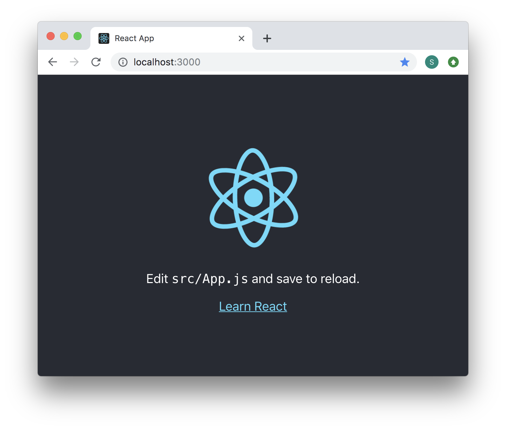

# React in a Nutshell 🌰

Bonjour! Today we'll be creating a translator app using [React](https://reactjs.org/), a popular JavaScript framework. You've likely heard a lot about React through the ether, however, don't be intimidated. JavaScript is [notorious](https://www.quora.com/What-is-JavaScript-fatigue) for making simple things difficult. I've made this tutorial as simpel to follow as possible. Watch out for "lol's" if you get lost.  Allons-y!

## Tidbits

- Join our discord server! Ask questions! 
- My favorite React resources
  - [Codecademy](https://www.codecademy.com/learn/react-101)
  - 

## Prerequisites 👈🏾

- [HTML](<https://www.codecademy.com/learn/learn-html>)
- [CSS](<https://www.codecademy.com/learn/learn-css>)
- [Terminal](https://www.codecademy.com/learn/learn-the-command-line/modules/learn-the-command-line-navigation-u)

## Setup ⚙️

- Install [Node.js](https://nodejs.org/en/download/) on your machine.
- Open your terminal and enter `npm install --global create-react-app`.

### lol, what are these terms?

- [Node.js](https://nodejs.org/en/) allows you to run the JavaScript language on your computer. JavaScript typically runs inside of a web browser, so installing <u>Node.js</u> is important for running JavaScript outside of a web environment.
- [npm](https://www.npmjs.com/about) is a huge library of downloadable JavaScript code. Developers use it to share code publicly. We'll be importing code from <u>npm</u> for our project.
- [create-react-app](https://github.com/facebook/create-react-app) is a command to generate a React project from a template. We'll be using this to create the starter files for our app.

## Getting Started 🚦

Open your terminal and enter `create-react-app hello-world   `. Next,  `cd` into the `hello-world` directory and run `npm install`.

```bash
$ create-react-app hello-world # Run `create-react-app`.
$ cd hello-world # `cd` into the "hello-world" directory
$ npm install # Install `npm` files.
```

`npm install` installs all of the code that our project needs to run. Next, enter `npm run start` into your terminal. This starts a server running our React app.


Next, visit [http://localhost:3000](http://localhost:3000/). http://localhost:3000 is the web address that our server is running on.



Great job, you've just created a *working* React app! However, it doesn't have custom code yet. Open the project directory in your favorite editor (I recommend [VSCode](https://code.visualstudio.com/)), navigate to the <u>src/</u> folder, and open <u>src/App.js</u>.

Change some of the HTML-like text returned by the `render()` method in <u>src/App.js</u>. Save your changes and open **the same browser tab**. 

*The text changed even though you didn't reload your browser*.

This happened because the `create-react-app   ` setup includes a nifty feature called "hot reloading". Basically, our React setup automatically switches out old-code for new-code when you save your files. "Hot reloading" allows you to view new changes to your code as you make them.

## File Structure 📁


Now that you have some working code, you're probably wondering which of the many files in our directory are useful to us (for example, <u>src/serviceWorker.js</u> is irrelavant to most developers). Important files include:

- JavaScript (.js) files that start with capitalized letters. These are **React components**, which are important. The file that you just edited, <u>src/App.js</u>, is the only React component in the <u>src/</u> directory.
- CSS (.css) files.

You won't be using <u>src/App.test.js</u> or any of the other files in this tutorial.

## Next Steps 👣

- Change more of the HTML-like syntax returned in the <u>src/App.js</u> component. Even though the HTML-like syntax *isn't actually HTML*, it acts like it. You'll learn more about what it actually is later on.
- Try adding interesting HTML elements such as images and [detail](https://developer.mozilla.org/en-US/docs/Web/HTML/Element/details) elements. (P.S. put images inside of the <u>public/</u> folder to access them. For example, an image "picture.png" inside of <u>public/</u> can be accessed like ``)
- Change the styles in <u>src/App.css</u>. You can't, however,  use CSS classes. We'll go over CSS styling in React later.

