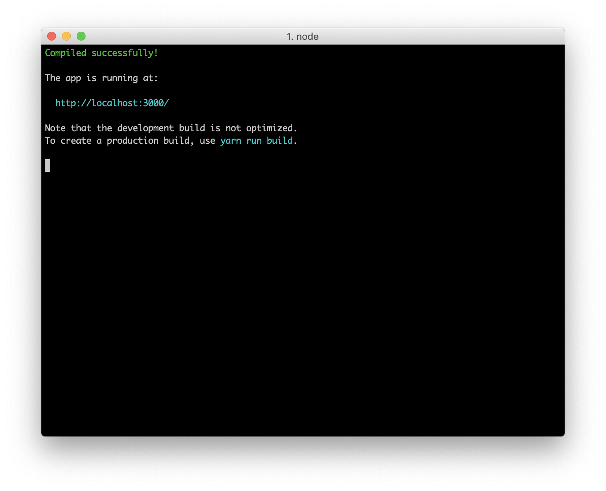
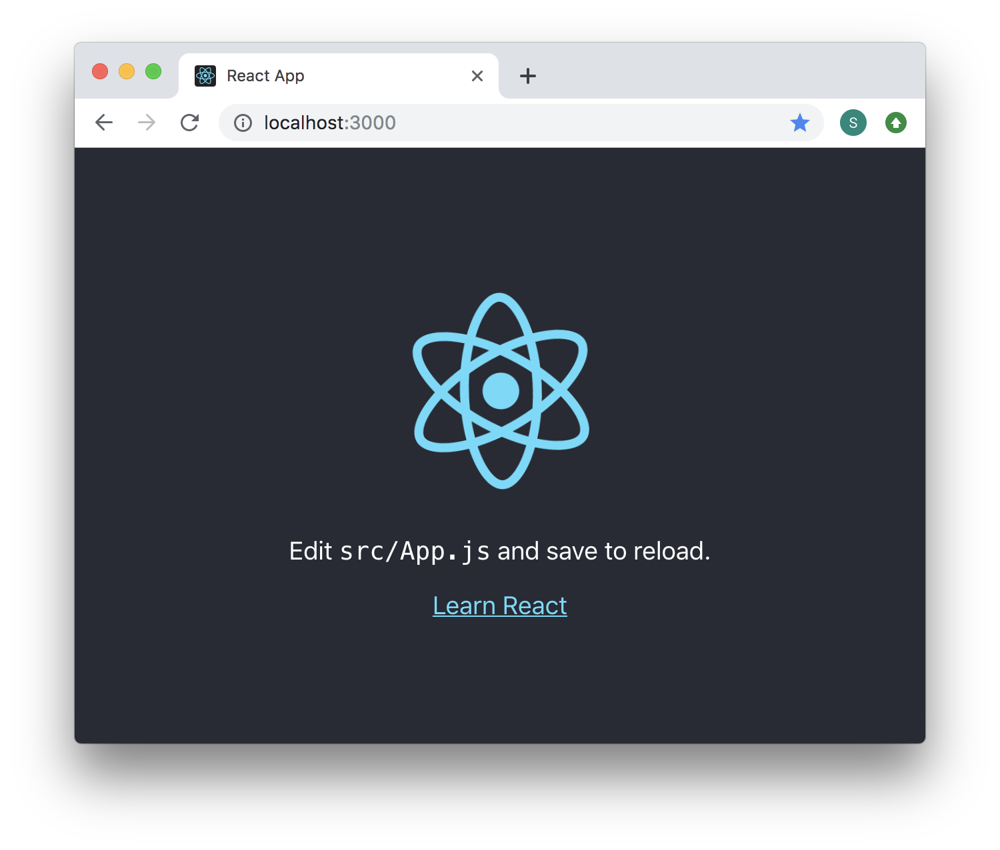
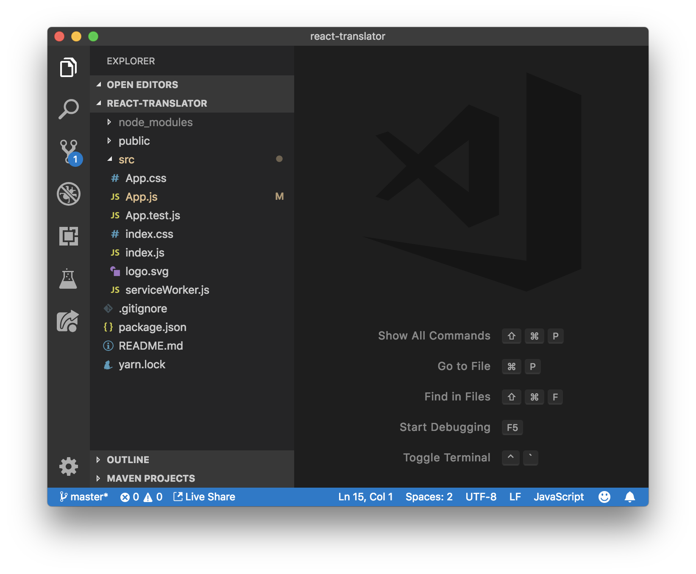
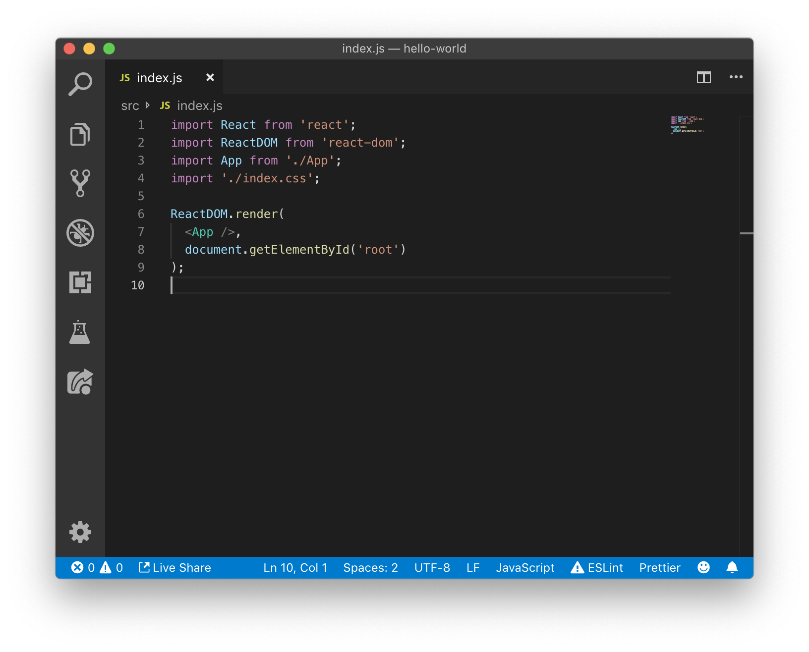

# React in a Nutshell 🌰

Bonjour! Today we'll be creating a translator app using [React](https://reactjs.org/), a popular JavaScript framework. You've likely heard a lot about React through the ether, however, don't be intimidated. JavaScript [notorious](https://www.quora.com/What-is-JavaScript-fatigue) for making simple things difficult. In reality, it's really easy to get up and runnning with React. Allons-y!

## Prerequisites 👈🏾

- [HTML](<https://www.codecademy.com/learn/learn-html>)
- [CSS](<https://www.codecademy.com/learn/learn-css>)

## Setup ⚙️

- Install [Node.js](https://nodejs.org/en/download/) on your machine.
- Open your terminal and enter `npm install ---global create-react-app`.

### What did I just do?

- [Node.js](https://nodejs.org/en/) allows you to run JavaScript on your computer. JavaScript is usually run in a browser.
- [npm](https://www.npmjs.com/about) is a huge library of downloadable JavaScript code. Developers use it to share code publicly.
- [create-react-app](https://github.com/facebook/create-react-app) is a command to generate a default file structure for your React project. 

## Getting Started 🚦

Open your terminal, run `create-react-app  `, and `cd` into the directory that you want to create your React project in and run `npm install`.

```bash
$ create-react-app hello-world # Create the react app.
$ cd hello-world # `cd` to your directory.
$ npm install # Install `npm` dependencies.
```

`npm install` installs everything that we need for our project to run. Next, enter `npm run start` into your terminal. This starts a server to view your React app.



Next, visit [http://localhost:3000](http://localhost:3000/).



Great job, you've just created a working React app! However, it doesn't feature any custom code yet. Open the project directory in your favorite editor (I recommend [VSCode](https://code.visualstudio.com/)), navigate to the <u>src/</u> folder and open <u>src/App.js</u>.

Change some of the text returned by the `render()` method in <u>src/App.js</u>. Save your changes and open **the same browser tab**. 

*The text changed even though you didn't reload your browser*.

This happen because the  `create-react-app   ` setup includes a nifty feature called "hot reloading", which automatically switches out old-code for new-code when you save your files. Hot reloading helps you visualize new changes to your code as you make them.

## File Structure 📁



Now that you have some working code, you're probably wondering which of those are important (for example, <u>src/serviceWorker.js</u> is irrelavant to most developers). Important files include:

- JavaScript (.js) files that start with capitalized letters are **React components**, which are important. The file that you just edited, <u>src/App.js</u>, is the only React component in the <u>src/</u> directory.
- CSS (.css) files.

You won't be using <u>src/App.test.js</u> or any of the other supporting files in this tutorial.



## Next Steps 👣

- Change more of the HTML-like syntax returned in the <u>src/App.js</u> component.
- Try adding rich HTML elements such as input boxes and images. (P.S. put images in the <u>public/</u> folder to access them using the "src" attribute on the `Image` element.)