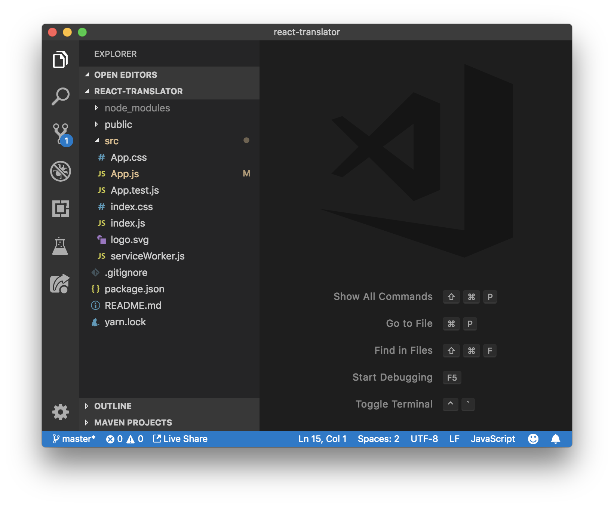

# React in a Nutshell: Making a Translator App

Bonjour! Today we'll be creating a translator app using [React](https://reactjs.org/), a popular JavaScript framework. You've likely heard a lot about React through the ether—there's a lot to talk about. However, don't be intimidated by what you may have heard! JavaScript [notorious](https://www.quora.com/What-is-JavaScript-fatigue) for making simple things difficult. In reality, it's really easy to get up and runnning with React. Allons-y!

## Prerequisites 🗒

I *strongly* recommend that you know basic [HTML](<https://www.codecademy.com/learn/learn-html>) and [CSS](<https://www.codecademy.com/learn/learn-css>) before starting this tutorial. Codeacademy has really helpful tutorials for each. For those already familiar with HTML and CSS, but new to JavaScript, not to worry! I'll go into the what and why of every line of JavaScript code that I write.

### How should I read this tutorial?

You should be writing code as you read this tutorial. Writing acutal code is the best way to get comfortable writing applications. Additionally, you should treat this tutorial as a starting guide for working with React. You might want to read it more than once and come back to sections taht you feel uncomfortable with.

## Setting up ⚙️

### Before you begin...

- Install [Node.js](https://nodejs.org/en/download/) on your machine
- That's all that you need!

### Run this command

After you've installed node, open your terminal and enter...

```bash
$ npm install ---global create-react-app
```

This will globally install the ` create-react-app` command so that you can use it anywhere on your system.

#### Advanced Understanding: What is all of this?

- [npm](https://www.npmjs.com/about) is a huge repository of downloadable JavaScript code. Developers use it to share projects and libraries (React for example) publicly. If you're coming from Python, this is `pip` for JavaScript programmers.
- [create-react-app](https://github.com/facebook/create-react-app) is a command to generate the starter files for your React project. Why? Setting up React projects from scratch is tiresome and a wasted effort. Use boilerplate commands such as `create-react-app` when possible.

## Creating your first project 🙌🏾

Now that you have the `create-react-app` command installed on your system, you can use it to create a new React project.

Open your terminal, `cd` into the directory that you want to create your React project in and enter:

```bash
$ create-react-app hello-world # Create the react app.
$ cd hello-world
$ npm install # Install `npm` dependencies.
```

Once you've done this, open the project directory in your favorite text editor (I recommend [VSCode](https://code.visualstudio.com/)) and open the `package.json` file.


The `package.json` file is where we keep information that `npm` needs to know about our application. Notice how the `dependencies` property contains package names followed by versions. When you ran `npm install`, npm took all of these dependencies and made them available to JavaScript code in your project. Now you will be able to import the "react" and "react-dom" packages  into your project later on.

Also notice how the `scripts` property contains some terminal commands and aliases for those commands. We'll use the `start` alias to run `react-scripts start` the command to preview your React app.

Enter `npm run start` into your terminal to run the start command. This spins up a local development server used to view your app.


Your terminal output show match the above. Go to your web browser and enter the localhost link ([http://localhost:3000](http://localhost:3000/)).


Great job! You've just created a working React app! However, it doesn't feature any custom code yet. Open the project directory in your favorite editor (again, I recommend [VSCode](https://code.visualstudio.com/)), navigate to the <u>src/</u> folder and open <u>src/App.js</u>. 

Change some of the text in the HTML-like syntax returned by the `render()` method in the <u>src/App.js</u> file. Save your changes and open the same browser window. 

*The text changed even though you didn't reload your browser.*

This works because the `create-react-app   ` setup includes a nifty feature called "hot reloading". This basically means that React automatically switches out old-code for new-code when you save your files. Hot reloading helps you visualize new changes to your code as you make them.

### So many files...



Now that you have some working code, you're probably wondering what all of these files are. Some are important, some are less important. For example, <u>src/serviceWorker.js</u> is irrelavant to most developers. However, JavaScript (.js) files that start with capitalized characters are React components, which are definitely very important. The file that you just edited, <u>src/App.js</u>, is the only React component in this directory. It's also the *root* component of this application. What exactly does that mean? Open <u>src/index.js</u>.


<u>src/App.js</u> is the root component because it is the only component that React renders to the `root` node of the document. The root node of the document is just a special `div` element that contains the entire application. Now open <u>public/index.html</u>.


All that the `ReactDOM.render()   `method does is call the `render()` method on the <u>src/App.js</u> component and inject the "HTML" returned by the component into the `div` element with the id "root". Don't worry too much about how the  `ReactDOM.render()` method works under the hood. The <u>src/index.js</u> file is the only instance that we will be using this piece of code.

### Homework

Change the HTML-like syntax returned in the <u>src/App.js</u> component. Try adding rich HTML elements such as input boxes and audio elements and observe how they render just like an ordinary webpage with HTML.


