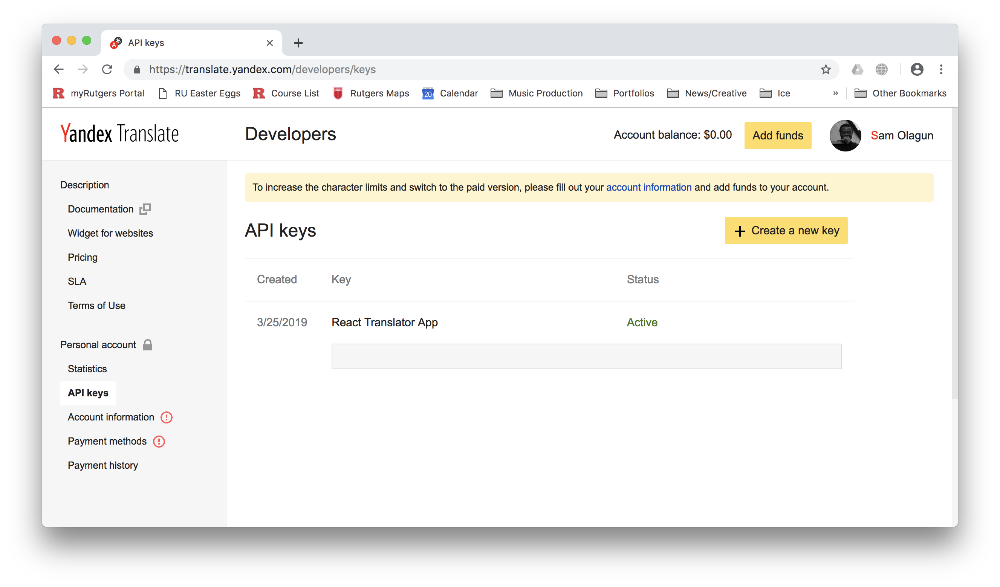

# APIs and Asynchronous JavaScript

Today we're going to be use the [Yandex Translation API](<https://tech.yandex.com/translate/>) to translate text. I've intentionally selected the Yandex Translation API over other translation APIs because it is refreshingly simple to use. We're going to use all of the skills that we learned from the previous few weeks to make a full application.

#### Ok, but what exactly is a "API"?

An API is a way of asking for information from a server. You *request* specific types of information from a server at a specific URL and get a *response* back. A sample request in JavaScript might look like this:

```javascript
// URL to request from.
const requestUrl = "http://api.someserver.com/books/fantasy/?count=10";

// Fetch response from the server.
const response = await fetch(requestUrl);
```

There are a few important parts to this. The first is the URL itself. Notce how it has multiple parts—the first is the *location* of the server `http://api.someserver.com` , the second is the *path* of the data that we're looking for `books/fantasy`, the last is a special *argument*, `count` that limits our response to ten items. This API doesn't actuall exist, I made it up, but it should give you a good idea of how web APIs work. Find the server *location*, Add some *paths*, some special *arguments* (which we call *query parameters* by the way) and voila, you get some data back from the server. Usually APIs will document how they are to be used in their API documentation. Watch out for that.

### Registering for the Yandex Translation API

To use Yandex's API service, we have to register with them as a developer. Navigate to their [website](<https://tech.yandex.com/translate/>) and register for a new developer account.

After you create a new account, navigate to the [Yandex API key dashboard](https://translate.yandex.com/developers/keys?) and "Create a new key" with any description that you like. What you've just done is created an API Key, you'll need that later to make requests like the one shown above.

####What's an API 🔑?

An API key is a *unique* string used to identify an application. It's important that we do this with *every* request so that the API Provider knows that it's *our* application that is requesting information from their service and some other developer's application. Additionally, this identification step is helpful because if we need to edit API settings or pay for an API, the API Provider knows exactly who those settings apply to and who to charge.

```javascript
// URL to request from.
const requestUrl = "http://api.someserver.com/books/fantasy/?count=10";

// API 🔑
const apiKey = "somegobbledygook123";

// Fetch response from the server.
const response = await fetch(requestUrl + "&apiKey=" + apiKey);
```

#####API 🔑 Security

Notice how I redacted the API key string in the screenshot above. *Keep your API key secure*. It's good practice to remove API keys from your code before posting it on GitHub or anywhere public.

## Using the Yandex Translation API

Aformentioned, the rules for using any API are typically contained within the *API documentation.* To view Yandex Translate's documentation, click on the "Documentation" link under the "Description" label at the top left of your API dashboard.


As the Yandex documentation describes, their documentation will tell us how to add text translation to our app. We can use these sections as a rough guideline for thinking about the data requirements of our application. Our application might need...

- A way to detect the language of a source text
- A way to get all of the supported destination translation languages 
- A way to translate text from the source language to one of the destination languages

Thankfully, Yandex's Translation API supports all of these actions. Let's sketch out what this might mean for our React app.

### Thinking About Our Component State

Let's take another look at data requirements that I mentioned Yandex's API satisfied.

- A way to detect the language of a source text
- A way to get all of the supported destination translation languages 
- A way to translate text from the source language to one of the destination languages

If we codify these actions and data requirements into methods, we get something like...

````javascript
class App {
  // Detect the language of some source text.
  detectLang() {}
  
  // Gets the list of supported langauges to translate into.
  getDestLangs() {}
  
  // Translates text
  getTranslatedTxt() {}
}
````

This is great, but it doesn't tell us any specific information about the API. It doesn't tell us what special arguments each API request needs, how we should make the requests or any information like that.

#### Detecting the Source Langauge

If we look at the [documentation](<https://tech.yandex.com/translate/doc/dg/reference/detect-docpage/>) sub-page for detecting the source langauge, there's a specific syntax specification.


Yandex allows us to get data back in two different ways, XML and JSON. Today, we're going to be using JSON because its much easier to work with. In order to make our JSON request work were going to need to follow the request syntax. The request syntax on this page has required fields key and text and the optional fields hint and callback. Let's codify this is into a method that makes a request to do just that.


We want to get the the list of supported languages when the app starts. React has a special method for this called **.componentDidMount()**. We need to update that `dstLangs` property of the state such that when the component mounts, we fill the select boxes with a list of available langauge options.

```react
componentDidMount() {
  // Fill the state with destination languages.
  this.getDstLangs();
}
```

Next, let's sketch out the translate method.

```react
async translate() {
  // 1) Detect the language of the text.
  const srcLang = await this.detectLang(this.state.srcTxt);
  
  // 2) Get the currently selected destination language.
  const dstLang = this.state.dstLang;
  
  // 3) Translate the text.
  const translatedTxt = await this.getTranslatedTxt(this.state.srcTtxt, srcLang, dstLang);
  
  // 4) Update the state.
  this.setState({
  	translatedTxt
  });
}
```

Now that we know how our methods are going to function in our translate method, let's implement them.

#### Getting the Source Langauge

If we look at the [documentation](<https://tech.yandex.com/translate/doc/dg/reference/detect-docpage/>) sub-page for detecting the source langauge, there's a specific syntax specification.


Yandex allows us to get data back in two different ways, XML and JSON. Today, we're going to be using JSON because its much easier to work with. Under the request syntax section, Yandex specifics 

Before we even talk about how we're going to request data from 

After we get all of this data, we need a way to make sure that new information


We want to get the the list of supported languages when the app starts. React has a special method for this called **.componentDidMount()**. We need to update that `dstLangs` property of the state such that when the component mounts, we fill the select boxes with a list of available langauge options.

```react
componentDidMount() {
  // Fill the state with destination languages.
  this.getDstLangs();
}
```

Next, let's sketch out the translate method.

```react
async translate() {
  // 1) Detect the language of the text.
  const srcLang = await this.detectLang(this.state.srcTxt);
  
  // 2) Get the currently selected destination language.
  const dstLang = this.state.dstLang;
  
  // 3) Translate the text.
  const translatedTxt = await this.getTranslatedTxt(this.state.srcTtxt, srcLang, dstLang);
  
  // 4) Update the state.
  this.setState({
  	translatedTxt
  });
}
```

Now that we know how our methods are going to function in our translate method, let's implement them.

#### Getting the Source Langauge

If we look at the [documentation](<https://tech.yandex.com/translate/doc/dg/reference/detect-docpage/>) sub-page for detecting the source langauge, there's a specific syntax specification.


Yandex allows us to get data back in two different ways, XML and JSON. Today, we're going to be using JSON because its much easier to work with. Under the request syntax section, Yandex specifics 


```react
async detectLang(txt) {
  let url = "https://translate.yandex.net/api/v1.5/tr.json/detect?";
  url += "key=" + API_KEY + "&text=" + encodeURIComponent(txt);
  
  const response = await fetch(url);
  console.log("src lang response: ", response);
}

```


```react
async detectLang(txt) {
  let url = "https://translate.yandex.net/api/v1.5/tr.json/detect?";
 	url += "key=" + API_KEY + "&text=" + encodeURIComponent(txt);
 
  const response = await fetch(url);
  const json = await response.json();
  
  return json.lang;
}
```


#### Translation

In reality, we want the code inside of the fucntion that we're callin onClick to look like the follwing.

```react
<button onClick={() => {
   // Translate the text and update the state.
   this.translate();
}}>
</button>
```

But we haven't actually implemented a translation in our componenet yet.

```react
async translate() {
  // Translate our text.
} 
```

 This is the part where we need to the datat that we have about our translation to perform the translation. However, we have to give the API the information taht it wants and use the rules and specification of the API to extract the informaiton that we need. Remeber when I suggested that we store the default destination language, Enlish as the abbreviation "en"? I made that choice after reading the rules that the API that we're going to used. The API requires that we supply it with langauge informaiton using an abbreviation.


## Designing your `state` object

Go ahead and open **App.js**. Notice how this `App` component doesn't have a `state` object yet. You do, however, need a `state` because our application is going respond to user events and is eventually going to request data from an *API*. Before we start building, let's quickly sketch out the data requirements of translator app. Our app needs:

- <u>Source text</u>: the text that we're going to translate (text box)
- <u>Destination languages</u>: a referenece list of destination langauges (select box)
- <u>Destination language</u>: the selected item from the list of destination languages
- <u>Translated text</u>: our translated text

Codified, the sketch that we designed might look like:

```react
state = {
  srcTxt: "",
  dstLangs: { en: "English" },
  dstLang: "en",
  translatedTxt: ""
}
```

Note that our `state` object is currently acting as a placeholder. None of the properties have any useful information store within them, only default values. Also notice how I specifically chose to store the source and destination langauges as abbreviations rather than fully qualifeid names. I'll talk about why I did this later when you actually translate our text using the Yandex translation *API*. Now that you've created out placeholder or initial state, let's make some visual elements!

*P.S. Notice how I didn't include the source text language in our `state` object. You will detect the source language using the translator API, so you don't need to specify it.*

## Displaying `state` with the `render()` method

I've talked aobut the `render()` method a few times now. Rendering is just creating a visual representation of our state. Let's inspect the visual components of each property in our state.

```javascript
state = {
  srcTxt: "", // Editable Text Box
  dstLang: "en", // Select Box Value
  dstLangs: { en: "English" }, // Select Box Options
  translatedTxt: "" // Text Box
}
```

As you can tell from above, not all properties of our state have visual components. For example, your translate `button` isn't included in our ` state` object because it won't have any data associated with it, only the `onClick` *callback* that is called when the `button ` clicked. Now let's integrate what we've already learned  about state, JSX, and rendering to dispaly some content.

### Rendering the Destination Languages Select Box

```react
<select value={this.state.dstLang}>
    {Object
      	.entries(this.state.dstLangs)
        .map(([dstLangAbbrev, dstLang]) => {
            return <option value={dstLangAbbrev}>
              {dstLang}
            </option>
          })}
</select>
```

This is probably the most complex part of the rendering code, because it requires some knowledge about how JavaScript works. The first important part is the `this.state.dstLang` property that I'm assigning to the `select` elements value. A `select` element in HTML simply a dropdown element. The value of the `select` element is the value of the currently selected item in the dropdown. Here, I'm setting this value to `this.state.dstLang` which is set to "en" by default.

The JavaScript expression within the `select` element is a bit more complex.

#### How `Object.entries` works

`Object.entries `converts a JavaScript object into an array containing key, value pairs.

```javascript
// languages object
const langs = { en: "English", fr: "French"};

// logs [["en", "English"], ["fr", "French"]]
console.log(Object.entries(favorites));
```

This method is particularly useful for our project because you need to iterate through every abbreviation key and it's associated value in parallel.  You can call another useful method, `map` on the array of pairs returned by `Object.entries` to transform the array of  language, abbreviation pairs into an array `option   `elements for our `select` dropdown. 

#### How does `option` work?

The `option` element has two important pieces of information attached to it—the `value  ` attribute and the text that you put inside of it. The text that we put inside of our `option` element indicates how the element appears in a `select `menu. The `value` attribute indicates how what each list item means in terms of our code. When a user clicks on a drop down item with the text "English", you want to view that value as "en" in code, not "English". The fully qualified langauge name is only for the user to view. Attaching a value attribute to our `option` element makes it easy to attach a representation of the dropdown item that is *valuable* to us code-wise.

```react
<select value={this.state.dstLang}>
    {Object
      	.entries(this.state.dstLangs)
     		// Map over pairs language, abbreviation pairs and return `option` element.
        .map(([dstLangAbbrev, dstLang]) => {
            return <option value={dstLangAbbrev}>
              {dstLang}
            </option>
          })}
</select>
```

When your app component is instantiated, the JSX above will initialize to:

```react
<select value="en">
  <option value="en">English</option>
</select>
```

### Rendering the Source Text Box and Translate Button

```react
<div>
  <textarea defaultValue={this.state.srcText} />
  <div>{this.state.translatedTxt}</div>
</div>

<button>
	Translate
</button>
```

Under our destination languages select box, you can add a `textarea` for the user to enter some source text. You can also add a `div` container element to display the translated text. Lastly, you can add a translate `button` that the user will click to trigger a translation. 

Great! Now you've setup the structure of your application, you need to add some code to make it interactive. To do this this, you need to add *callbacks* to handle user events such as `onClick` and `onInput`

```react
// "App.js" file.
import React from 'react';

class App extends React.Component {
  state = {
    srcTxt: "",
    dstLang: "en",
    dstLangs: { en: "English" },
    translatedTxt: ""
  }

  render() {
    return (
       <div>
        <select value={this.state.dstLang}>
          {Object
              .entries(this.state.dstLangs)
              .map(([dstLangAbbrev, dstLang], index) => {
                  return <option key={index} value={dstLangAbbrev}>
                    {dstLang}
                  </option>
                })}
        </select>

        <div>
          <textarea defaultValue={this.state.srcText} />
          <div>{this.state.translatedTxt}</div>
        </div>

        <button>
          Translate
        </button>
      </div>
    );
  }
}
```

You want to change your `state` object in reaction to interaction that a user may have with the application. Here, we want to update our application state whenenver the user clicks on the translate button. This means that we have to listen for the user action which is clicking the translate button, and change the state to reflect thetransalted text.

```react
<button onClick={() => {
   // Translate the text and update the state.
}}>
</button>
```


requests require us to wait for values because they take an arbitrat amoutn of time

wait for values that we don't yet have


Translating our Text

Polishing with some CSS

### Conclusion

### Resources

-


How does this API thing work?

```JavaScript
const requestData = async () => {
  const url = "https://jsonplaceholder.typicode.com/todos/1";
  const text = await fetch(url);
  const json = await text.json();
  return json;
}
```

How does async work?

It works perfectly in our callback because we have no code after it, even if it did, we would wrap that in an other async function

